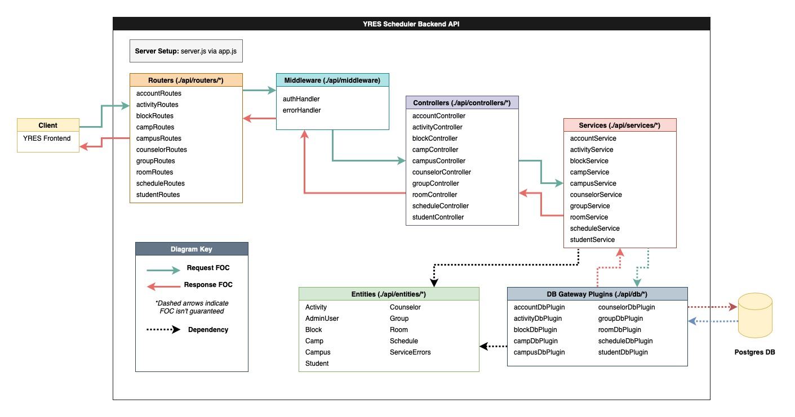
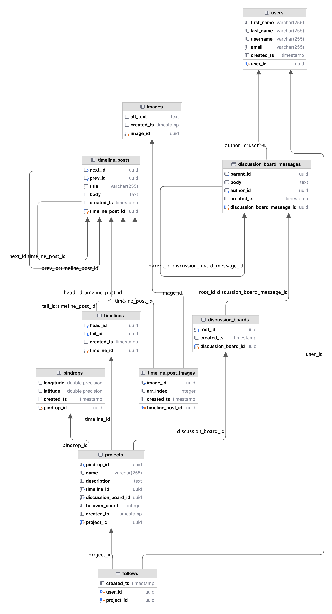

&emsp;&emsp;

# 🌸 Rewild it: Backend API 🌸
&emsp;

**Rewild it** is a platform to organize, collaborate and inspire grassroots rewilding initiatives within local communities across Toronto.

This repository contains the codebase for the Backend API of the Rewild it mobile application. The codebase for the Frontend component of the application is [here](https://github.com/skoooch/rewild-it-interface). This project is being developed as part of the University of Toronto [School of Cities App Development Competition](https://schoolofcities.utoronto.ca/programs-opportunities/app-development-competition/).

## What is Rewild it?

### Young People vs. Toronto's Biodiversity Crisis

Toronto is in a biodiversity crisis. Decades of rapid growth and economic expansion have coincided with the mass destruction of the city’s natural habitats. Toronto has fewer bird species, butterflies and bees today than ever before in history. Polling by Ipsos ([Young Canadians' Attitudes on Climate Change](https://www.ipsos.com/sites/default/files/ct/news/documents/2021-10/CYACA%20Report%2020211004_0.pdf)) has shown that threats to the environment/climate change ranks among the most important issues for young people in Canada. Despite this, 60% of young people feel that their generation is “not doing enough” to address the issue.

> **Rewild it** will empower young people to take action to improve biodiversity in their local community by organizing grassroots-led rewilding initiatives in every corner of the city!

Rewilding initiatives can effectively target areas for restoration and conservation efforts, which not only enhances regional biodiversity and ecosystem health, but also contributes to sustainable regional development amidst rapid urbanization. Rewild it will give Toronto residents the tools to identify, share and organize rewilding initiatives in their local community.

### Minimum Viable Product (MVP) Description
Users will contribute to a collaborative map of Toronto, where regions with potential for rewilding can be marked with relevant photos and information as part of a new “rewilding project". A discussion board will be created for each project so that users can discuss the best approaches for rewilding (i.e. what plant species, bird boxes, bee habitats etc.) that are appropriate for the area’s wildlife needs. Users can follow projects to keep up to date with progress. Projects will be tracked via a high-level timeline, which will document progress and facilitate high-level engagement (e.g. petitioning, event RSVP etc.). The map will be layered and color-coded for types of rewilding projects (e.g.blue for birdboxes, red for wildflower projects). Rewild it may be expanded to include additional features such as learning resources and tools for reporting invasive plant/wildlife species to municipal authorities.

## How can I contribute?
**Rewild it** is an open-source initiative, managed by [@HarveyRDonnelly](https://github.com/HarveyRDonnelly) (Backend Lead) and [@skooch](https://github.com/skoooch) (Frontend Lead). Support and code contributions are very welcome!

**Here are a few steps for getting started with Backend API development:**

1. Clone the Rewild it Backend API project repository:
   
   `git clone https://github.com/HarveyRDonnelly/rewild.git`
   
3. Set up a suitable development environment on your local machine. The Rewild it Backend API is built following [RESTful API](https://restfulapi.net/) principles using `go1.21.4`, with a `PostgreSQL 16.2` database. We recommend using an IDE with [Golang](https://go.dev/) support such as [GoLand](https://www.jetbrains.com/go/) or [VS Code](https://code.visualstudio.com/docs/languages/go). The database and backend API are containerised using [Docker](https://www.docker.com/) and orchesterated using [Docker Compose](https://docs.docker.com/compose/). Testing can be carried out using a HTTP request tool such as [Postman](https://www.postman.com/)
  
5. Browse the issues tab on Github and find something that is suitable given your development experience. This might be a big or an enhancement. We recommend selecting an issue that is tagged as a "good first issue" if one is available. We also encourage you to  define your own issues. Project maintainers can be tagged or contacted to receive feedback on new issues.

If you are ever stuck or need some help getting started, reach out to a project maintainer. **We are here to help! :)**

5. When your code contribution is complete, make a PR with at least one project maintainer assigned as a reviewer. Some feedback may have to be implemented before a PR is approved and merged.

6. The changes will be pushed to the production environment when a new release is made.

### Runnng the Backend API

1. Clone the Rewild it Backend API project repository:

   `git clone https://github.com/HarveyRDonnelly/rewild.git`

2. Build the docker containers:

   `docker-compose build`

3. Run the docker containers (detached):

   `docker-compose up -d`

### Backend API Architecture
The backend API architecture for release `1.0.1` is documented in the below diagram. 

### Database Schema
The database schema is defined in [`rewild-it/db/create_schema.sql`](/db/create_schema.sql). The database schema for release `1.0.1` is documented in the below diagram.

